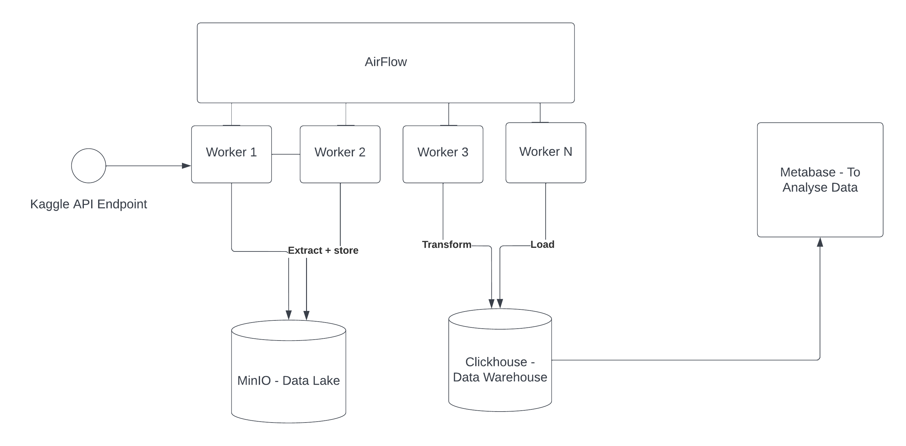

### Requirements

- Build Data Warehouse given Flipkart dataset.
- Perform Dimension Modelling and creates dimension and fact tables.
- The data in warehouse will be used by Metabase to visualize by analyst.

### Technical Requirements

- Data will be downloaded from Kaggle API and stored in Data lake MinIO (AWS S3 alternative)
- Use Airflow to perform ETL and transform data to store in Data Warehouse ClickHouse ( Snowflake Alternative)
- Connect Metabase to let Data Analyts and Buissness Leaders take decisions based on data.

### Architecture 

- Build a data warehouse which consists of all normalized data from Flipkart dataset. 
- Data is available as CSV. Perform ETL over it and dump to a data warehouse.
- Use AWS S3/any other locally hosted as data lake to store incoming data before Extract Stage.
- Use Airflow for ETL.
- Perform Dimension Modelling and create Dimensions and Fact table.
- Use Clickhouse for OLAP as its free

### Tasks

- [ ] Write Technical Requirement Document for Kaggle API and its extraction of data - Source Data
- [ ] Setup Airflow Docker Compose on Local Machine. - Workflow Scheduler
- [ ] Setup ClickHouse Docker - Data Warehouse
- [ ] Setup  MinIO Docker - Data Lake
- [ ] Extract Data from Kaggle API and dump to Data Lake
- [ ] Transform Data from Data Lake
    - [ ] Normalize Data
    - [ ] Build Dimension and Facts Table - Dimension Modelling
    - [ ] Writeup Documentation
- [ ] Load Dimensions and Fact Table in Data Warehouse
- [ ] Connect MetaBase to visulize data.

